# 软件工程实践2

## 一：任务分析
### 1.1 任务目的
* 巩固强化软件编程规范：通过团队合作开发，强化代码编写规范和团队合作意识。   
* 提高面向对象软件建模与抽象能力：在项目开发中实践面向对象的设计和实现。  
* 培养小组协同开发能力：通过Github进行小组协同开发，体验团队合作的全过程。  
* 掌握基于Maven的软件项目管理机制：利用Maven进行项目构建和依赖管理。  
* 掌握基于Github的小组协同开发工具和平台：熟悉Github的issue管理、分支模型、Actions等功能。  
* 了解DevOps软件开发流程：通过自动化测试、自动化部署等实践，了解DevOps的基本流程。

### 1.2 任务内容
1.创建软件开发小组:  
* 组建3-5人的开发小组，推选组长负责组织、协调和领导团队开发
。  
* 所有成员加入同一个Github仓库，共同开发。

2.开展小组讨论，确定功能扩充点：  
* 针对样例工程“world-of-zuul”，进行小组讨论，确定至少5项系统结构优化或功能扩充需求。  

3.基于Github中的issue管理功能明确工作任务并为组员分配工作任务：  
* 将工作任务细化，明确开发计划和里程碑时间节点。  
* 在Github上创建issue并分配给组员，明确每位组员的工作任务。  

4.基于小组商定的分支模型进行软件功能开发，并按开发流程进行代码测试、提交、归并和同步：  
* 小组成员在各自的工作分支进行开发，定期同步到远程仓库。  
* 按照小组约定的规范填写代码提交说明，确保提交代码符合规范。  
* 利用Github Actions进行自动化代码格式检查和测试，确保代码质量。  

5.尝试进行代码自动化打包，自动生成可供执行的jar文件：  
* 利用Maven和Github Actions进行自动化打包，生成可执行的jar文件用于系统发布。  

### 1.3 任务要求  
确定功能扩充点：  
* 扩展房间内物品存放功能  
* 实现“back”命令  
* 实现传输功能的房间  
* 新建Player类并实现玩家携带物品功能  
* 新增“take”和“drop”命令  
* 增加“items”命令  
* 增加magic cookie物件和“eat cookie”命令  
* 支持网络多人游戏模式  
* 增加图形化用户界面  
* 增加数据库功能  

### 1.4 任务输出
* 所有工作基于Github平台完成，在项目根目录下创建REPORT.md文件，对项目实训过程进行报告。  
* 所有源代码应包含规范化标注。 
* 每位同学以Word文档格式提交个人实训报告。 


## 二：开发计划

以下是为本次实验确定的开发计划，涵盖整个项目的不同阶段，包括创建团队、讨论需求、任务分配、开发、测试、提交和报告编写。该计划将详细列出各个步骤的具体内容和时间安排。

### 2.1 开发计划：
**（1）6.18：项目启动与需求分析**
* 组建开发小组：  
  * 选择组长，确定团队成员。
  * 在GitHub上创建一个新仓库，并邀请所有成员加入。  
* 需求讨论与分析：  
  * 小组讨论，确定系统结构优化需求或功能扩充需求，不少于5项。  
  * 记录讨论结果，形成需求文档。  

**（2）6.19：设计与分支管理**
* 设计系统结构：  
  * 根据需求，设计系统的总体架构和各模块的详细设计。  
  * 绘制类图和流程图，确认设计方案。  
* 制定分支模型：  
  * 确定团队使用的Git分支模型。  
  * 创建主分支、开发分支和各自的功能分支。  

**（3）6.19-6.24：功能开发（各成员在各自的功能分支上开发任务）**
* 前端开发：  
6.19-6.20：基于Vue-ElementUI搭建前端初始框架，实现登录、注册以及地图展示等功能。  
6.21：实现背包物品显示、丢弃、使用等功能。  
6.22：界面和代码结构优化，实现多人游戏聊天界面的构建。  
6.23：实现websocket连接和不同广播信息，优化聊天室界面。  
6.24:勇闯动物园2.0version发布。  

* 后端开发：  
6.18：数据库代码实现、后端框架补充。  
6.19：实现查找用户接口、用户登录接口的实现；登录返回前端token。  
6.20：实现修改密码接口、获取物品信息接口；添加drop、go、back接口；优化数据结构。  
6.21：增加check功能和背包查询功能；完善注解；更新数据库表。  
6.22：添加个性化需求；添加传送功能。  
6.23：添加webSocket，实现后端到前端的主动通信；建立聊天室；添加后端物品更新。  
·定期同步代码到远程仓库，并提交Pull Request。  

**（4）6.25：测试与集成**
* 单元测试：  
  * 编写单元测试，确保每个功能模块的正确性。  
  * 在提交Pull Request前，确保所有测试通过。  
* 集成测试：    
  * 合并各功能分支到开发分支，进行集成测试。  
  * 解决集成过程中出现的冲突和问题。  

**（5）6.25：自动化与发布**
* 自动化打包：  
  * 使用Maven配置自动化打包，生成可执行的jar文件。  
  * 配置GitHub Actions进行自动化打包和发布。  

**（6）6.26-6.27：报告编写与总结**
* 编写REPORT.md：  
  * 在项目根目录下创建REPORT.md文件，总结项目的设计过程和完成情况。  
  * 描述系统架构、实现的功能、遇到的问题和解决方案。  
* 个人报告：
  * 每位同学以Word文档格式提交个人实训报告，描述自己承担的任务和完成情况。  
* 项目演示：  
  * 准备项目演示材料，展示项目功能和实现过程。  
  * 进行项目演示和答辩。  

### 2.2 任务分配：  


#### 1.前端搭建任务——陶梓  
**基础任务：**  
（1）实现前端界面的设计。  
（2）实现前端逻辑以及负责对接后端接口的设计。  
（3）利用issues功能分配队员任务。  
（4）ppt制作。  

**基本功能实现：**  
（1）实现登录、注册、修改密码功能模块。  
（2）实现用户的移动和back功能模块。  
（3）用户背包与房间的物品交互，take、drop和use功能模块。  
（4）实现用户行为的监听，进行界面实时更新。  
（5）利用websocket建立多人游戏模块，实时更新在线人数，可进行多人聊天。  


#### 2.后端搭建任务——尹享哲
**基础任务：**  
（1）建立后端与数据库的连接。  
（2）实现后端逻辑以及负责后端接口的设计。  
（3）利用actions实现自动化打包与发布。  
  
**基本功能实现：**  
（1）实现后端与数据库连接。  
（2）创建合适的数据库表。  
（3）实现登录、注册、修改密码功能接口。  
（4）实现用户的go和back功能接口。  
（5）用户背包与房间的物品交互，take、drop和use功能接口。  
（6）利用websocket建立多人游戏，实时更新在线人数，可进行多人聊天 。 

#### 3.项目搭建任务——詹钧皓  
**基础任务：**    
（1）项目需求分析。  
（2）系统结构设计。  
（3）UML图设计  
（4）REPORT.md编写工作。  

**任务实现：**  
（1）根据任务需求，根据小组讨论确定并记录系统结构优化需求及功能扩充需求。  
（2）数据库表结构的设计。  
（3）设计类图、用例图等视图。  
（4）文档编写。  

## 三：软件开发过程和工具使用

### 3.1 软件版本计划

* 系统设计：基于此我们设计出了后端由Java Springboot提供网络服务，继承了网络API和随机传送、房间回退等业务逻辑，前端由服务器桥接层使用Node JS和Vue架构来对页面进行管理和布局；浏览器端负责对HTML文件进行渲染和Ajax数据加载的系统框架。  
   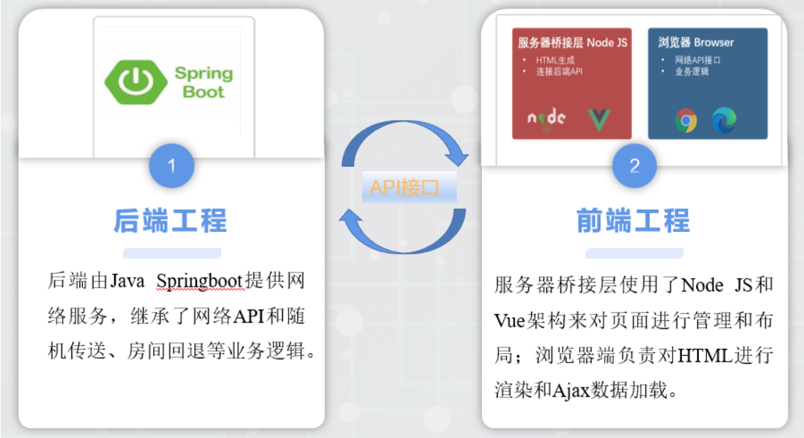

* 接口设计：通过将后端命令功能API接口化，使前端页面能够通过访问接口的方式触发命令。网页端通过提出get/post请求向服务器端提出访问，服务器端则通过接口返回相应的信息，从而实现后端功能的可视化。
·  确定系统需要对外提供的功能（如获取房间信息、获取玩家信息、操作物品等）。
·  设计 API 端点，确定每个端点的请求方法（GET、POST、PUT、DELETE）和路径。
·  定义 API 的请求参数和返回数据格式（通常使用 JSON）。
·  编写 API 文档，描述各个 API 的功能、参数、返回值和示例。  
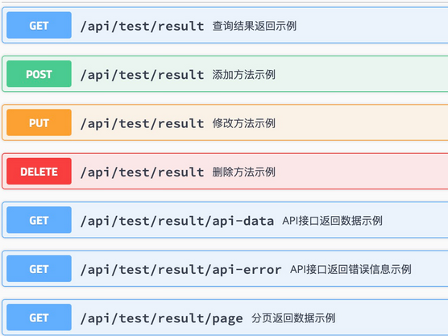
 
* 项目管理设计：在整个项目生命周期管理中，我们将引入 Maven 来对项目进行系统化管理，覆盖代码编译、依赖管理、测试执行等多个方面。Maven 的集成能够确保项目结构的一致性，并通过其插件机制实现自动化构建和测试，极大地提高开发效率和代码质量。
同时，我们采用 Git 进行版本控制，以其灵活性和强大的分支管理功能来支持项目的迭代开发和团队协作。Git 命令行工具允许我们精准地控制版本变更，进行代码合并和冲突解决，确保开发过程中的稳定性和连续性。  
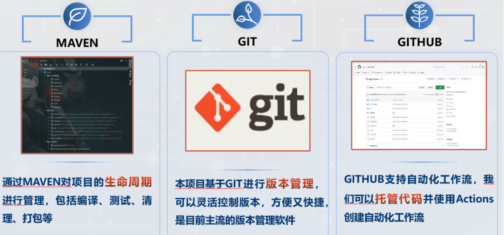

### 3.2 技术栈
#### 3.2.1 前端技术栈
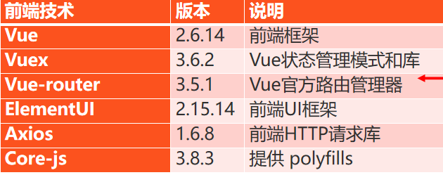
#### 3.2.2 后端技术栈
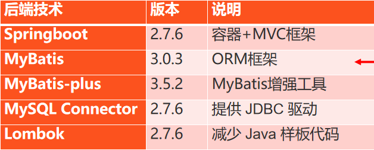

### 3.3 开发分支模型

* 主要开发分支
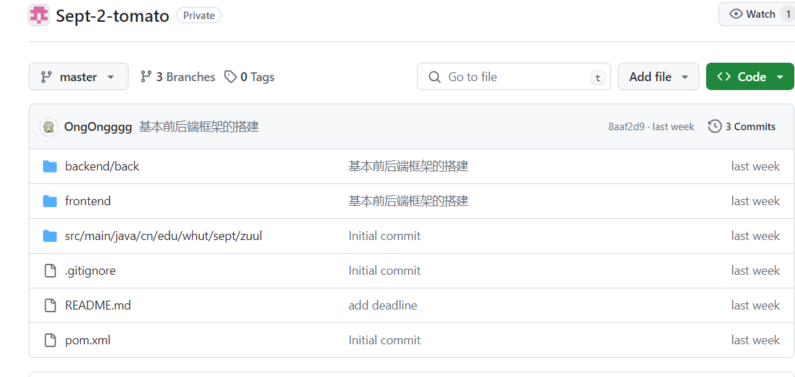
* frontend前端页面编写分支
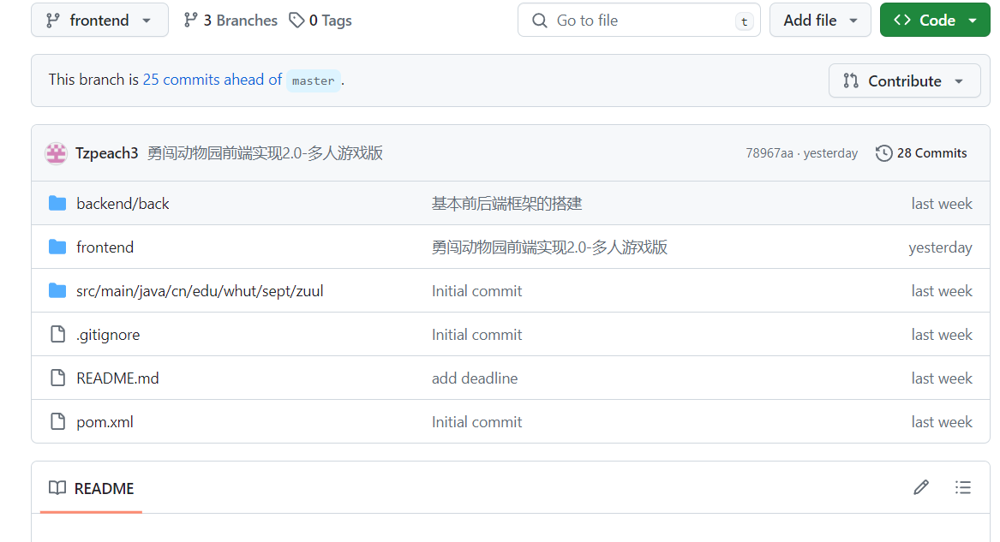
* backend后端开发分支
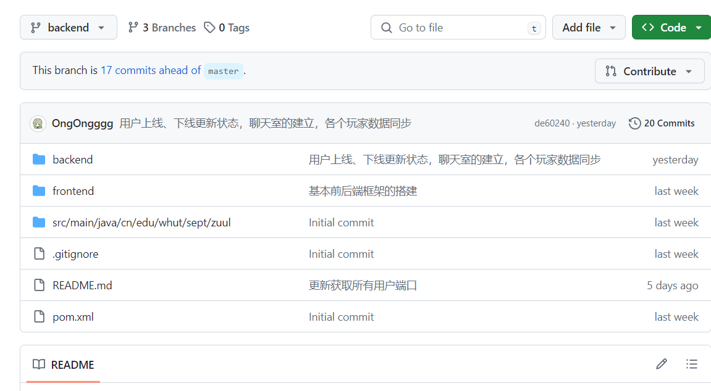


### 3.4 代码规范检查  

**使用github上的action进行代码规范检查：**

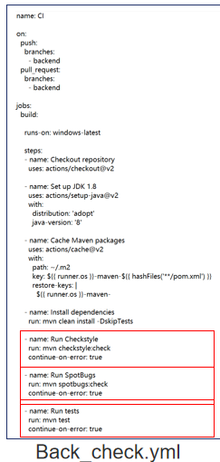


**Run Checkstyle：**
* 用于检查代码风格和代码质量
* 缩进检测
* 命名约定
* 代码注释

**SpotBugs：**
* 静态代码分析工具
* 内存泄漏
* 线程安全
* 运行错误

**Test：**
* 执行项目中定义的单元测试和集成测试

**github-action展示：**

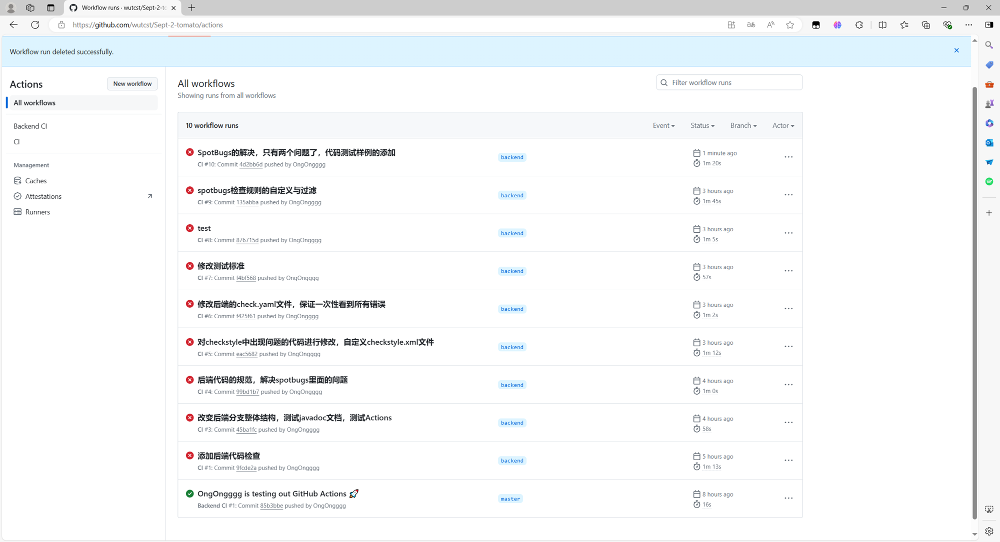

**修正后代码错误从1000+显著减少：**

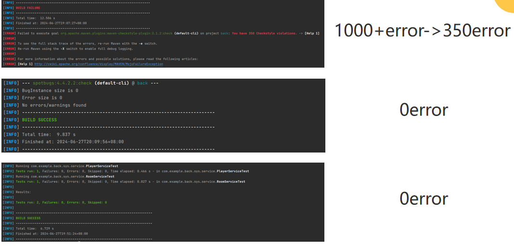


### 3.5 项目打包与发布  

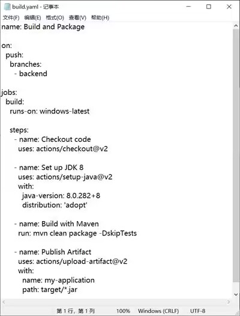

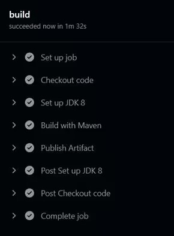

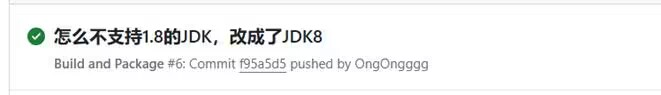


## 四：程序设计与开发

### 4.1 uml图示

* 类图
  
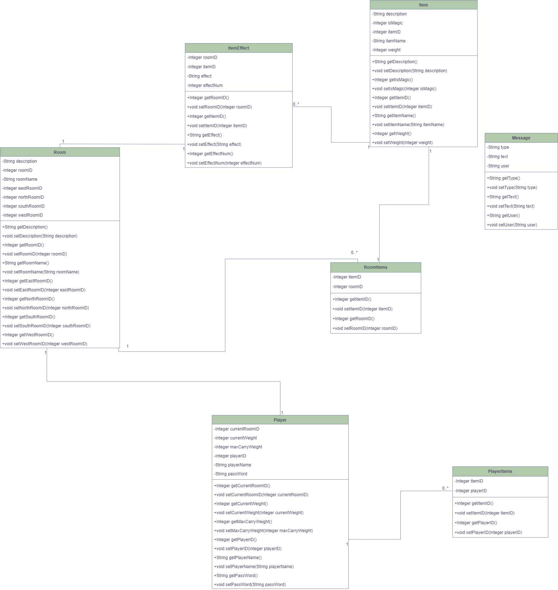

* 状态图
  
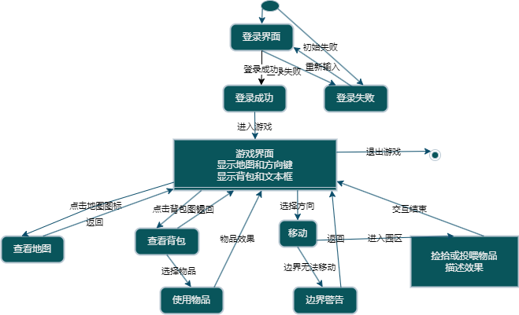

* 用例图  

下面是用例图的基本组成部分：  
* 参与者（Actor）：游戏的用户，即玩家。  
* 用例（Use Case）：玩家在游戏中能执行的功能。  

用例图元素说明：

1.参与者（Actor）：  
* 玩家  

2.用例（Use Cases）：  
* 注册  
* 登录  
* 查看地图  
* 移动（东、南、西、北）  
* 拾取物品  
* 丢弃物品  
* 投喂动物  
* 使用物品  

用例图描述：  
1.玩家：主要的参与者。  
2.玩家可以执行以下操作：  
* 注册：创建一个新账户。  
* 登录：使用账户信息进入游戏。  
* 查看地图：查看目前所在位置及各个园区的位置。  
* 移动：通过东、南、西、北四个方向键在动物园内移动。  
* 拾取物品：捡起路途中发现的物品。  
* 丢弃物品：丢弃不需要的物品。  
* 投喂动物：使用背包里的物品投喂不同园区的动物。  
* 使用物品：使用背包里的物品，如魔法饼干。
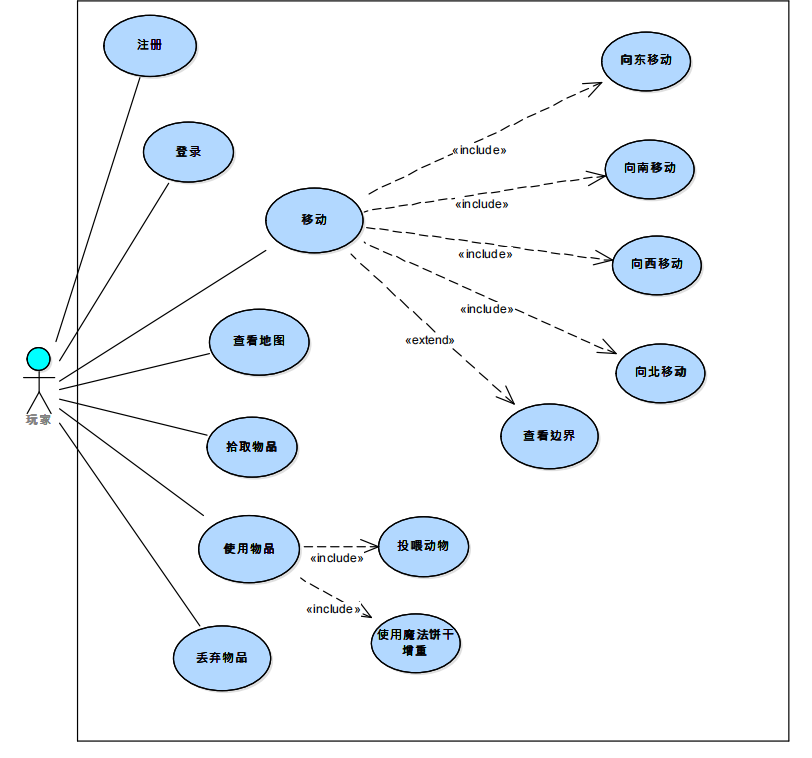


### 4.2 前后端设计与结构
#### 4.2.1 前端任务规划和功能开发：


**前端任务规划和设置：**

* 创建前端项目结构和基础配置（v1.1）
* 设计并创建玩家登录和注册界面（v1.2）
* 设计并创建物品管理和房间管理界面（v1.3）
* 集成React或Vue等前端框架，并初始化项目（v1.4）

**前端功能开发：**

* 实现玩家登录和注册功能页面（v1.5）
  
  * （1）登录界面开发
    * 创建登录页面的Vue组件。  
    * 使用Vue Router管理路由，并设置登录页面的路由。  
    * 使用Element UI组件库设计和构建登录表单。  
    * 实现登录表单的输入验证逻辑。  
    * 发起与后端的登录请求，并处理登录结果。  
    * 根据登录结果进行页面跳转或显示错误提示信息。  
  
  * （2）注册界面开发   
    * 创建注册页面的Vue组件。  
    * 使用Vue Router管理路由，并设置注册页面的路由。  
    * 使用Element UI组件库设计和构建注册表单。 
    * 实现注册表单的输入验证逻辑。  
    * 发起与后端的注册请求，并处理注册结果。  
    * 根据注册结果进行页面跳转或显示错误提示信息。  
  
  * （3）聊天界面开发  
    * 创建聊天页面的Vue组件。  
    * 使用Vue Router管理路由，并设置聊天页面的路由。  
    * 使用Element UI组件库设计和构建聊天界面的布局。  
    * 实现与后端的数据交互，包括发送和接收聊天消息。  
    * 显示聊天消息的历史记录和实时消息。  
    * 实现发送消息的功能，并处理发送消息的逻辑。  
    * 添加样式和动画效果，以提升用户体验。  

* 实现物品管理页面，包括查看、拿取、丢弃、使用等功能（v1.6）
* 实现房间管理页面，包括显示房间信息和移动玩家等功能（v1.7）
* 设计并实现前后端交互的WebSocket功能（v1.8）

**前端版本发布和测试：**

* 打包前端应用程序并部署到测试环境（v1.9）
* 进行用户界面的验收测试和跨浏览器兼容性测试（v1.10）
* 解决并关闭所有与v1版本相关的问题和反馈（v1.11）
* 迭代版本更新（v2版本）


#### 4.2.2 后端任务规划和功能开发

**后端任务规划和设置：**

* 创建后端项目结构和基础配置（v1.1）  
* 设计并创建Player和Item的实体类（v1.2）  
* 实现PlayerService和ItemService的基本功能（v1.3）  
* 设计并实现PlayerController和ItemController的基本接口（v1.4）  
* 集成数据库，并编写相关的Mapper接口和Mapper实现（v1.5）  

**后端功能开发：**

* 实现玩家注册和登录功能（v1.6）  
* 实现物品管理功能，包括查找、拿取、丢弃、使用等（v1.7）  
* 实现房间管理功能，包括查找房间、移动玩家等（v1.8）  
* 编写并执行单元测试和集成测试（v1.9）  

**后端版本发布和测试：**

* 打包后端应用程序并部署到测试环境（v1.10）
* 进行端到端的集成测试和性能测试（v1.11）
* 解决并关闭所有与v1版本相关的问题和反馈（v1.12）

#### 4.2.3前端项目结构： 

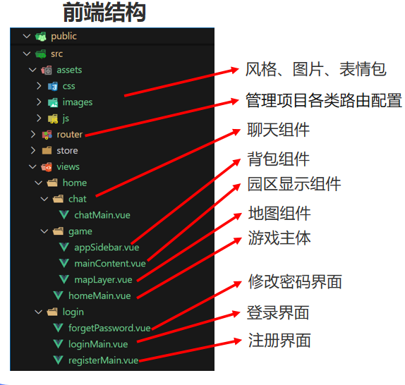

#### 4.2.4后端项目结构：

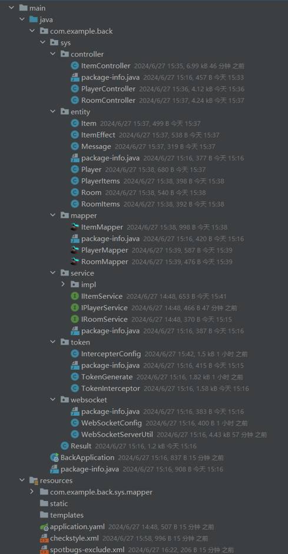


### 4.3 前后端功能设计


#### 4.3.1【功能实现1】：注册功能
**注册展示界面：**

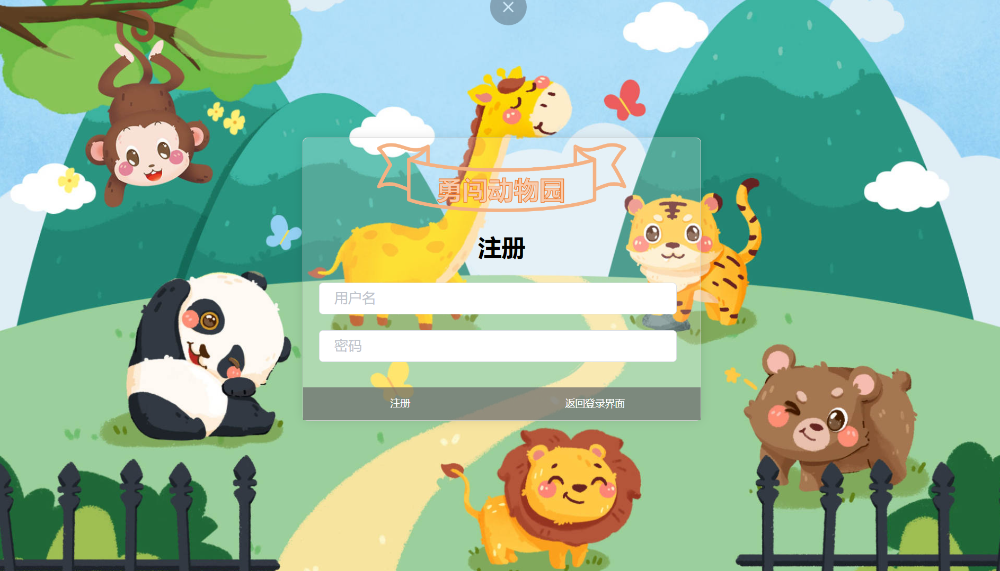
**前端注册验证部分代码：**


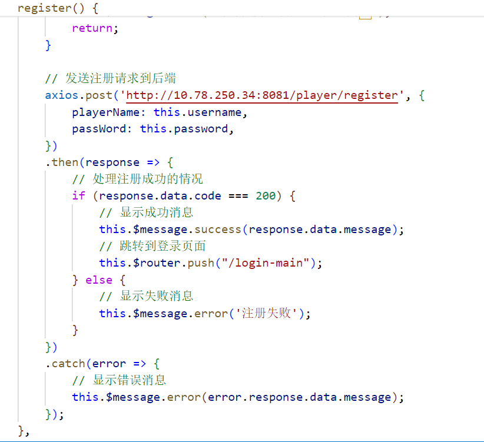

**注册功能（后端）：**

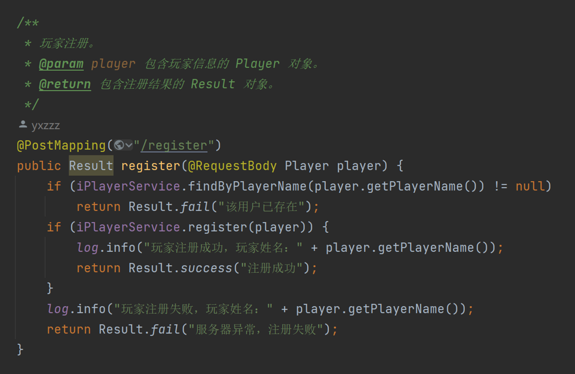

**访问数据库表操作：**

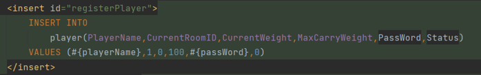

**数据库表变化：**

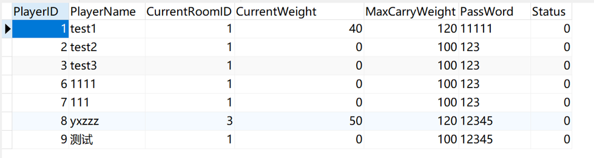

---


#### 4.3.2【功能实现2】：对移动键进行设计和实现

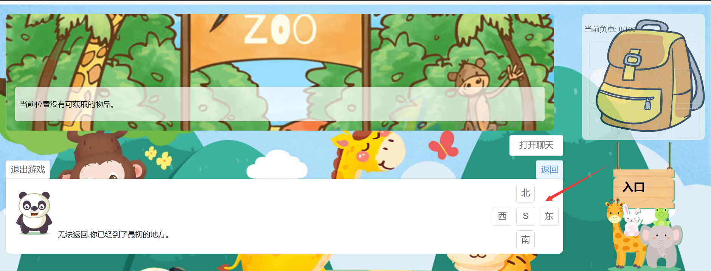

**数据库表 room**
在 java 中和数据库中的表字段进行定义
数据库表 room 主要字段及其含义如下：
| 字段名 | 数据类型 | 描述 | 长度 |是否允许为空 | 主键 |
| ------------- | ------ | ---------- |------| ---------- |------|
| `roomID` | integer | 房间 ID |  255 |Not null|是|
| `roomName` | string | 房间名称 |  255 |Not null|  |
| `eastRoomID` | integer | 东边房间 ID |  255 |Not null|  |
| `southRoomID` | integer | 南边房间 ID |  255  |Not null|  |
| `westRoomID` | integer | 西边房间 ID | 255 |Not null|  |
| `northRoomID` | integer | 北边房间 ID |  255 |Not null|  |

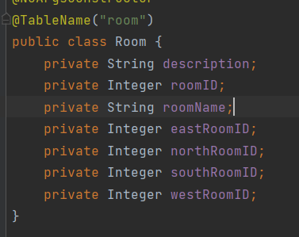

**数据库表 roomitems**

在 java 中和数据库中的表字段进行定义
数据库表 roomitems 主要字段及其含义如下：
| 字段名 | 类型 | 描述 |
| --------------- | ------ | ---------- |
| `roomID` | 主键 | 房间 ID |
| `itemID` | 主键 | 物品 ID |
| `itemName` | 字符串 | 物品名称 |
| `itemDescription` | 字符串 | 物品描述 |
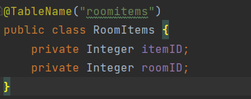


后端中实现用户移动实现和设计：  
move 方法:
* 根据玩家名称找到玩家对象，并获取玩家当前所在的房间。
* 根据方向（0: 东，1: 南，2: 西，3: 北）找到下一个房间的 ID。
* 如果方向无效或下一个房间不存在，返回失败的 Result。
* 更新玩家所在的房间，并返回成功的 Result。

```java
    private Result move(String playerName, Integer direction) {
        Player player = playerService.findByPlayerName(playerName);
        Room curRoom = roomService.findRoomByRoomId(player.getCurrentRoomID());

        Integer nextRoomID;

        switch (direction) {
            case 0:
                nextRoomID = curRoom.getEastRoomID();
                break;
            case 1:
                nextRoomID = curRoom.getSouthRoomID();
                break;
            case 2:
                nextRoomID = curRoom.getWestRoomID();
                break;
            case 3:
                nextRoomID = curRoom.getNorthRoomID();
                break;
            default:
                logger.warning("提供了无效的方向。");
                return Result.fail("不存在该方向！");
        }

        Room nextRoom = roomService.findRoomByRoomId(nextRoomID);
        if (nextRoom == null) {
            logger.warning("指定方向上没有房间。");
            return Result.fail("该方向上无房间");
        }
        player.setCurrentRoomID(nextRoomID);

        roomService.updatePlayer(player);

        return Result.success(nextRoom);
    }
```

go 和 back 方法:  
* 接收前端请求，调用 move 方法实现玩家移动。  
* go 方法用于向指定方向移动，back 方法用于向相反方向移动。

```java
    @PostMapping("/go")
    public Result go(@RequestBody Map<String, Object> request) {
        System.out.println(request);
        String playerName = (String) request.get("playerName");
        int direction = (int) request.get("direction");
        return move(playerName, direction);
    }
    @PostMapping("/back")
    public Result back(@RequestBody Map<String, Object> request) {
        String playerName = (String) request.get("playerName");
        int direction = (int) request.get("direction");
        return move(playerName, direction);
    }
```

getItemsInRoom 方法:  
* 接收前端请求，根据房间 ID 获取房间内的物品信息。  
* 如果房间不存在，返回失败的 Result。  
* 返回房间内的物品信息。  

```java
    @PostMapping("/check")
    public Result getItemsInRoom(@RequestBody Map<String, Integer> request) {
        Integer roomID = request.get("roomID");
        logger.info("检查房间内物品，房间ID：" + roomID);
        Room curRoom = roomService.findRoomByRoomId(roomID);
        if (curRoom == null) {
            logger.warning("不存在ID为" + roomID + "的房间。");
            return Result.fail("不存在该房间");
        }

        List<Item> items = roomService.checkItemsInRoom(roomID);
        logger.info("房间内的物品：" + items);
        return Result.success(items);
    }
```

前端中实现本功能的部分代码：  
在前端中的物品拿取跟放回的信息都会保存到 localstorage 中,而后端会根据点击的按钮进行对应的判断进行相应的请求返回。

```javascript
            async move(direction) {
                // 清除显示文本的定时器
                if (this.displayTimeout) {
                    clearTimeout(this.displayTimeout);
                    this.displayTimeout = null;
                    this.displayedText = this.dialogContent;
                }

                const playerName = this.getPlayerName();
                const token = this.getPlayToken();
                const directionsMap = {
                    'east': 0,
                    'south': 1,
                    'west': 2,
                    'north': 3,
                    'stay': 4,
                    'back': 5 // 添加返回操作
                };
                const directionsBack = {
                    'west': 'east',
                    'north': 'south',
                    'east': 'west',
                    'south': 'north',
                };
                const locationMap = {
                    1: '入口',
                    2: '猴子园区',
                    3: '狮子园区',
                    4: '大象园区',
                    5: '熊猫园区',
                    6: '出口'
                };

                if (!playerName || !token) {
                    console.error('本地存储中没有找到 playerName 或 token');
                    return;
                }
                try {
                    if (direction === 'back') { // 处理返回操作
                        if (this.visitedDirection.length > 0) {
                            const previousDirection = this.visitedDirection.pop(); // 获取上一个前进方向
                            this.backDirection = directionsBack[previousDirection];
                            const response = await axios.post('http://localhost:8081/room/go', {
                                playerName: playerName,
                                direction: directionsMap[this.backDirection],
                            }, {
                                headers: { 'token': token }
                            });

                            if (response.data.code === 200) {
                                const roomData = response.data.data;
                                this.currentRoomId = roomData.roomID;
                                this.dialogContent = `你回到了${roomData.roomName}。 ${roomData.description}`;
                            } else this.dialogContent = `无法往${this.getDirectionText(direction)}走，你现在在${locationMap[this.currentRoomId]}。`;
                        } else {
                            this.dialogContent = `无法返回,你已经到了最初的地方。`;
                        }
                    } else {
                        const response = await axios.post('http://localhost:8081/room/go', {
                            playerName: playerName,
                            direction: directionsMap[direction],
                        }, {
                            headers: { 'token': token }
                        });

                        if (response.data.code === 200) {
                            const roomData = response.data.data;
                            this.visitedDirection.push(direction);
                            this.currentRoomId = roomData.roomID;
                            this.dialogContent = `往${this.getDirectionText(direction)}走，你来到了${roomData.roomName}。 ${roomData.description}`;
                        } else {
                            if (directionsMap[direction] === 4)
                                this.dialogContent = `你停留在原地，你现在在${locationMap[this.currentRoomId]}。`;
                            else this.dialogContent = `无法往${this.getDirectionText(direction)}走，你现在在${locationMap[this.currentRoomId]}。`;
                        }
                    }
                } catch (error) {
                    console.error('请求出错:', error);
                }
            }
```
***


#### 4.3.3 【功能实现3】：Look功能（查看物品信息）

**Look功能前端界面展示：**
<div style="display: flex; justify-content: space-around;">
    
    
</div>

* 注：当鼠标移动到园区和背包的物品栏时，会显示对应的物品的信息

**前端展示园区信息部分代码：**

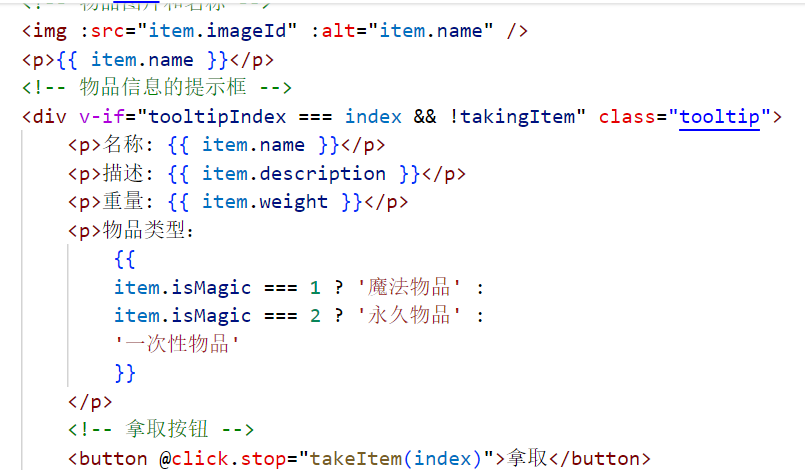

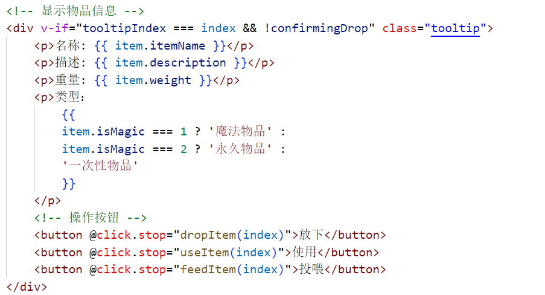

**Look功能查看物品信息（后端）：**

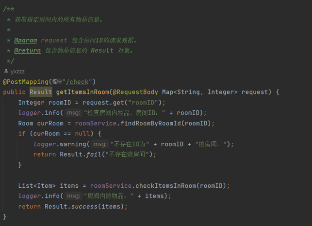

***

#### 4.3.4 【功能实现4】：Take功能

**Take功能前端界面展示：**
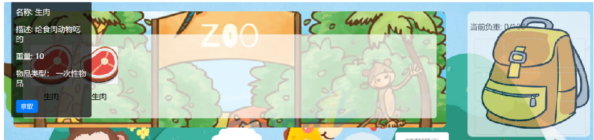

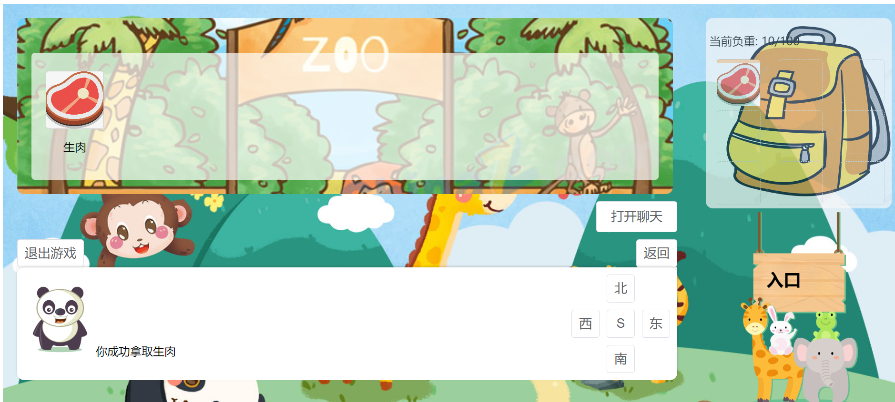
*  注：将鼠标移向想要拿取的物品并点击拿取按钮，物品移入背包

**Take功能前端部分代码展示：**
 
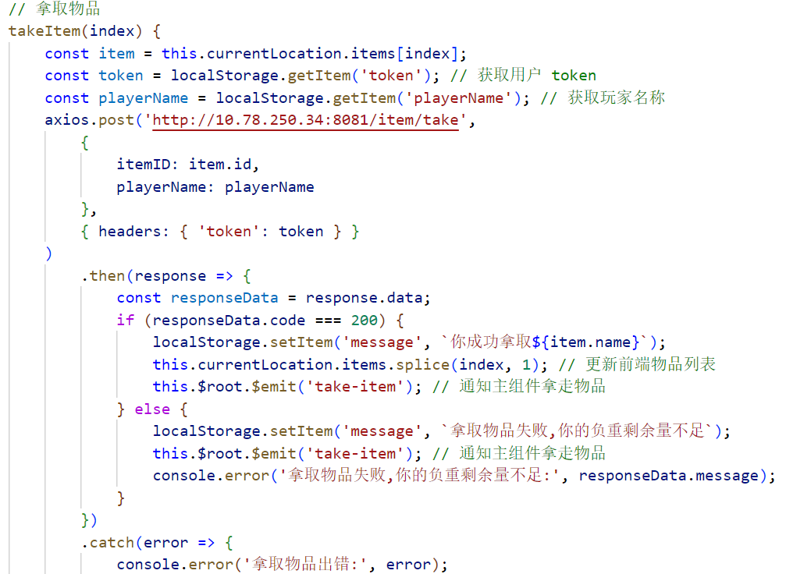

**Take功能后端代码展示：**
 
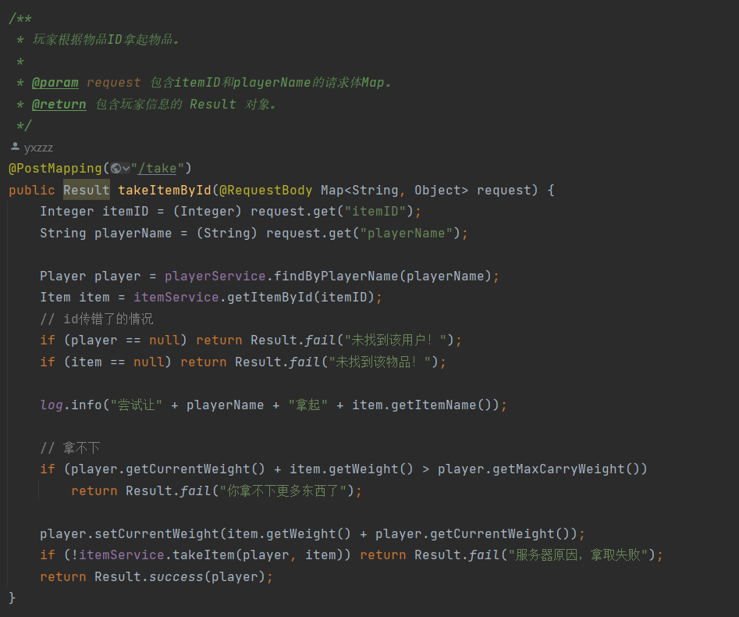

***

#### 4.3.5 【功能实现5】：Use功能（包含查看Map功能以及魔法饼干）
**Use功能前端界面展示：**

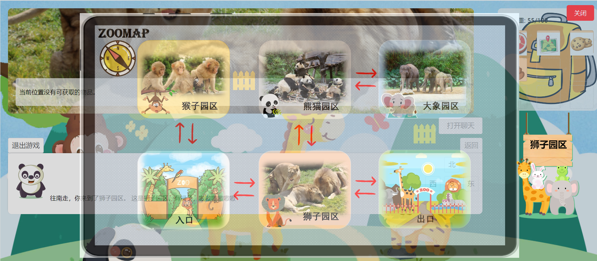

<div style="display: flex; justify-content: space-around;">
    
    
</div>

**对于不同的物品，存在不同的使用功效：**
* 对于地图，属于普通耐用型物品，不会存在损耗，但可以查看地图。  
* 对于其他物品，例如香蕉，生肉，大便，目前设置的为普通消耗品，食用并消耗，无特殊作用
* 对于魔法饼干，属于魔法一次性物品，食用后自身负重上限+10，并消耗。

**Use功能前端部分代码展示：**

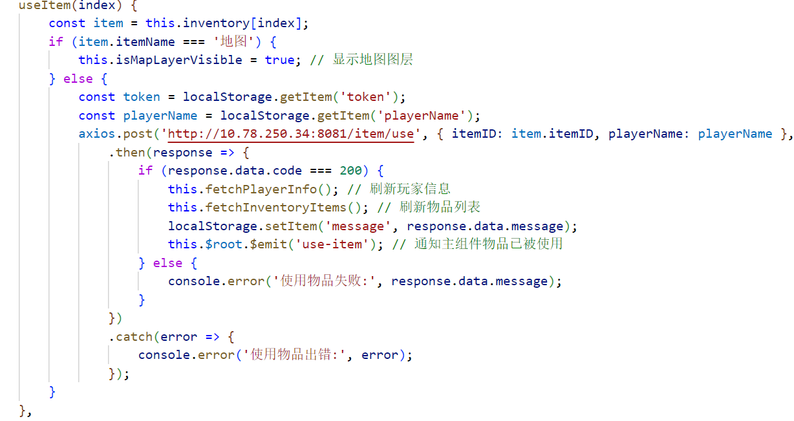

**Use功能后端代码展示：**

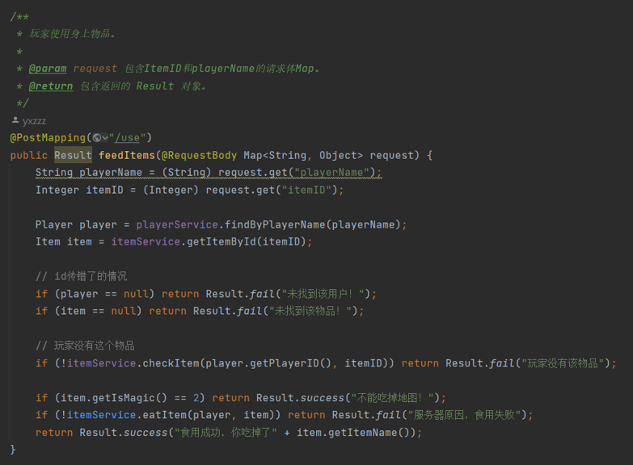

***

#### 4.3.6 【功能实现6】：Feed功能（包括传送功能）

**Feed功能前端界面展示：**

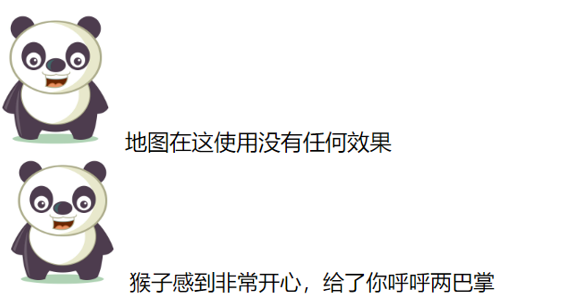

<div style="display: flex; justify-content: space-around;">
    
</div>

**对于不同的物品在不同园区进行投喂，存在不同的使用功效：**
* 对于地图和大便这类物品，在园区进行“投喂”是无效的。
* 对于生肉、香蕉这类物品，在部分园区进行“投喂”会产生消耗，并反馈动物反应（也会出现不能投喂）
* 对于香蕉，投喂给大象时，会实现传送功能，将玩家随机传送至某个园区

**Feed功能前端部分代码展示：**

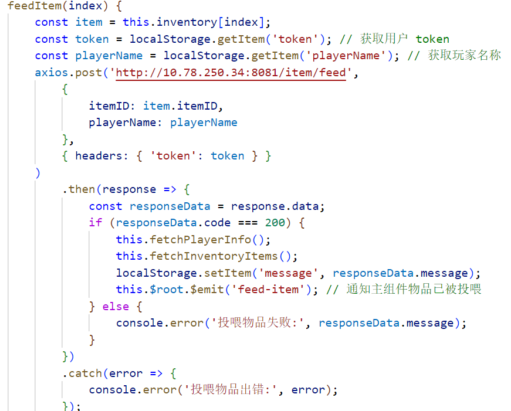

**Feed功能后端代码展示：**

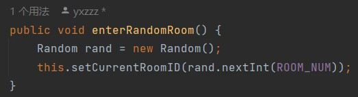

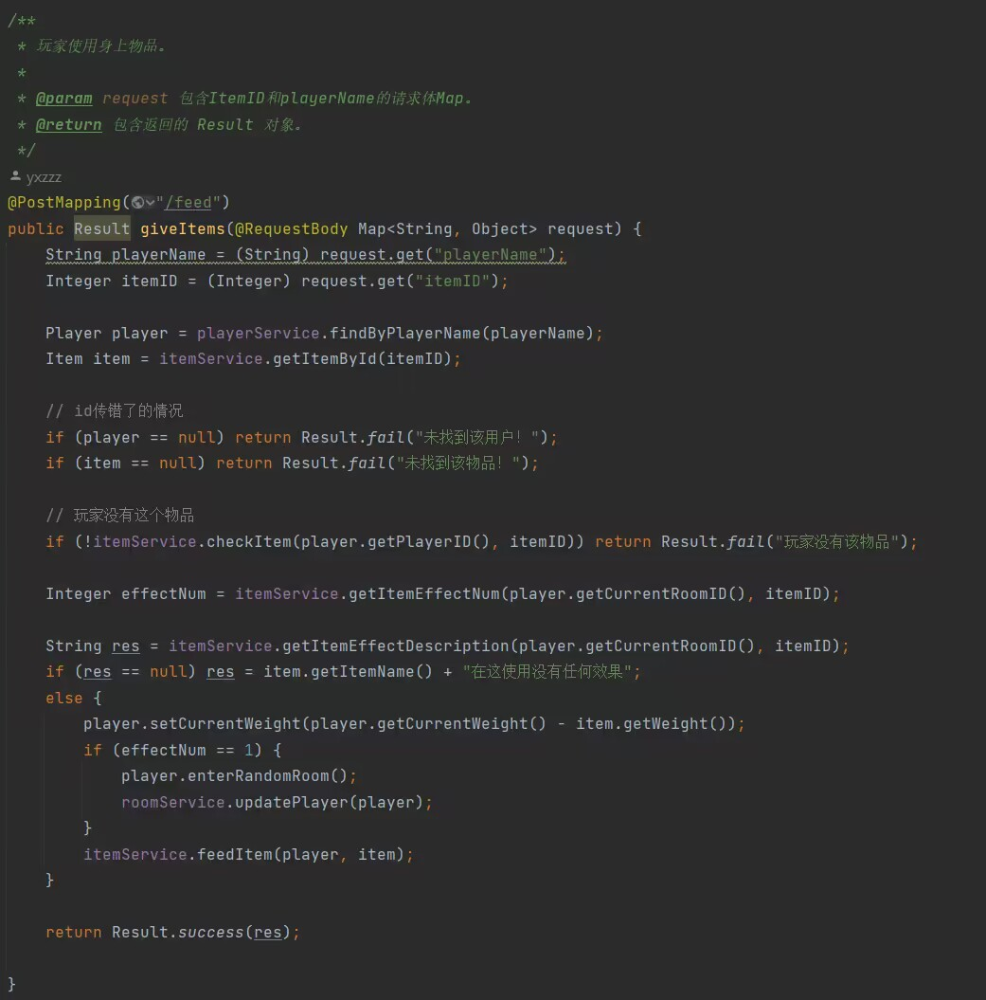

---

#### 4.3.7 【功能实现7】：多人聊天功能

**多人聊天功能前端界面展示：**

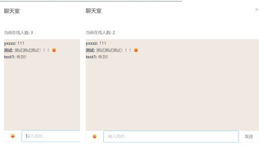

**用户可以在游戏时点击“打开聊天”按钮与在线玩家进行聊天：**
* 利用webSocket实现多人游戏
* 当用户在登录后有效token下游玩游戏，会显示自身在线，所有玩家更新当前在线人数
* 当用户发送消息时，所有玩家聊天框更新当前对话
* 当用户进行园区物品操作时，会广播告知全体玩家更新当前园区物品

**多人聊天功能前端部分代码展示：**

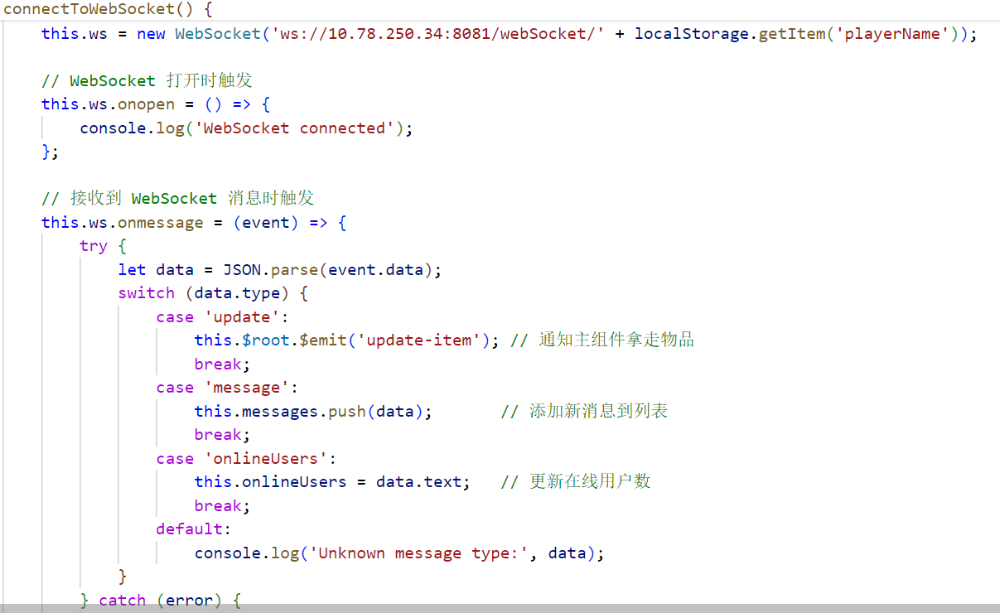

---


### 4.4 前后端测试及联调

**前后端交互的主要接口：**

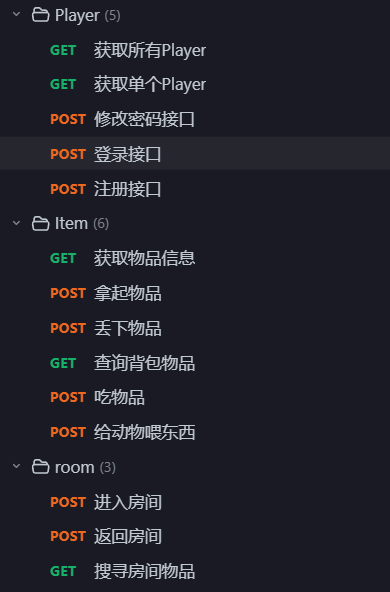

* player 中对应的路由接口：

| 接口                     | 描述             | 所需参数                 | 参数类型       | 请求方式 |
| ------------------------ | ---------------- | ------------------------ | -------------- | -------- |
| `/player/`               | 获取所有玩家信息 | null                     | null           | GET      |
| `/player/getPlayerInfo`  | 获取单个玩家信息 | `playerName`             | 字符串         | GET      |
| `/player/reset-password` | 修改密码         | `playerName`, `passWord` | 字符串, 字符串 | POST     |
| `/player/login`          | 登录             | `playerName`，`passWord` | 字符串, 字符串 | POST     |
| `/player/register`       | 注册             | `playerName`，`passWord` | 字符串, 字符串 | POST     |


* item 中对应的路由接口

| 接口                | 描述         | 所需参数                 | 参数类型       | 请求方式 |
| ------------------- | ------------ | ------------------------ | -------------- | -------- |
| `/item/getItemInfo` | 获取物品信息 | `itemID`                 | 整数           | GET      |
| `/item/take`        | 拿起物品     | `itemID`,`playerName`    | 整数,字符串    | POST     |
| `/item/drop`        | 丢下物品     | `playerName`, `passWord` | 字符串, 字符串 | POST     |
| `/item/getItems`    | 查询背包物品 | `playerName`,            | 字符串         | GET      |
| `/item/eat`         | 吃物品       | `itemID`,`playerName`    | 整数,字符串    | POST     |
| `/item/feed`        | 给动物喂东西 | `itemID`,`playerName`    | 整数,字符串    | POST     |


* room 中对应的路由接口  
  

| 接口          | 描述         | 所需参数                  | 参数类型    | 请求方式 |
| ------------- | ------------ | ------------------------- | ----------- | -------- |
| `/room/go`    | 进入房间     | `playerName`, `direction` | 字符串,整数 | POST     |
| `/room/back`  | 返回房间     | `playerName`, `direction` | 字符串,整数 | POST     |
| `/room/check` | 搜寻房间物品 | `RoomID`                  | 整数        | GET      |

我们使用apifox进行前后端测试：
* 修改密码接口
  
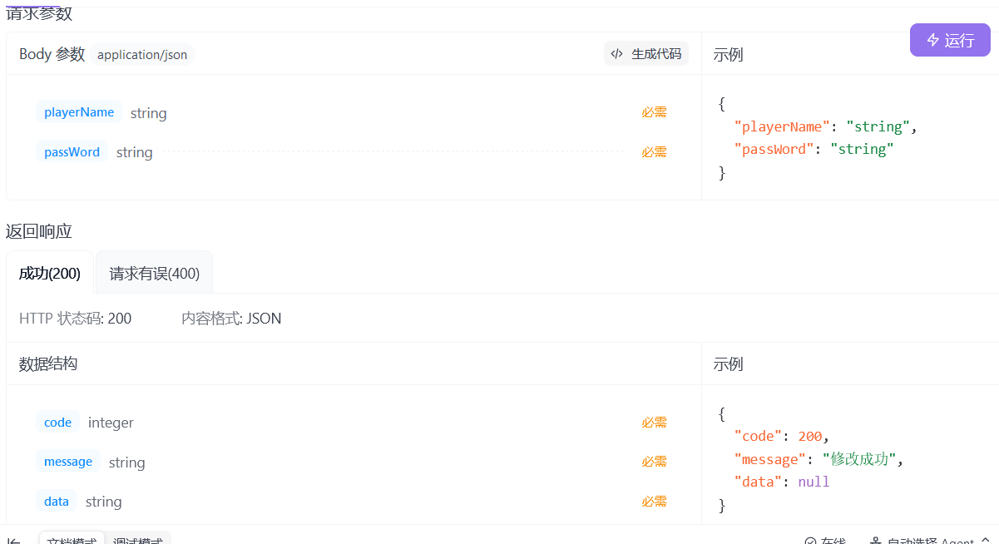

* 登录接口
  
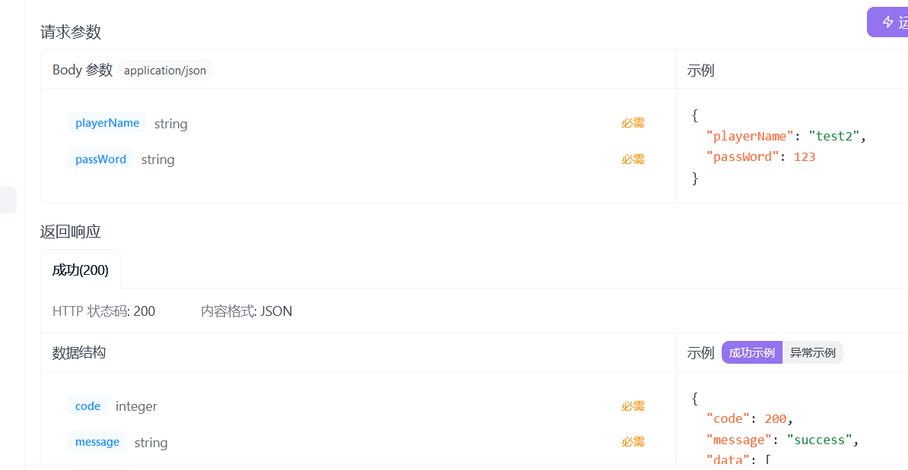

* 拿起物品
  
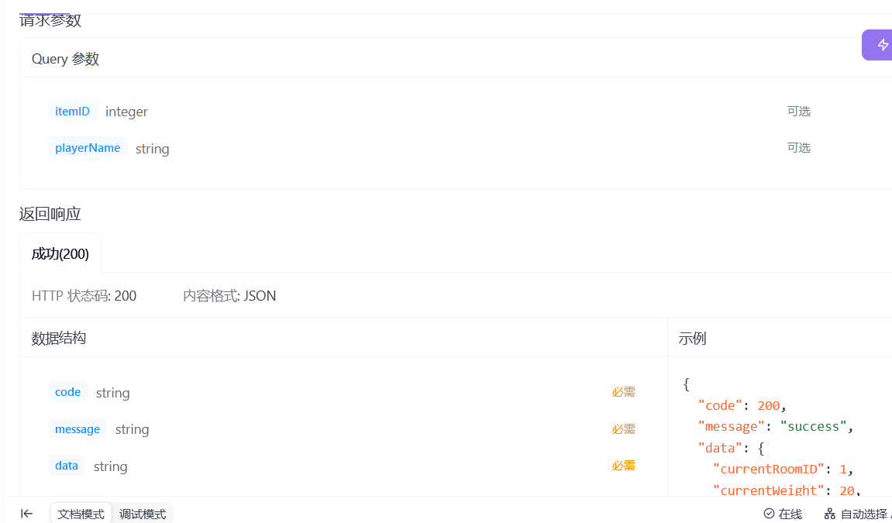

* item/drop
  
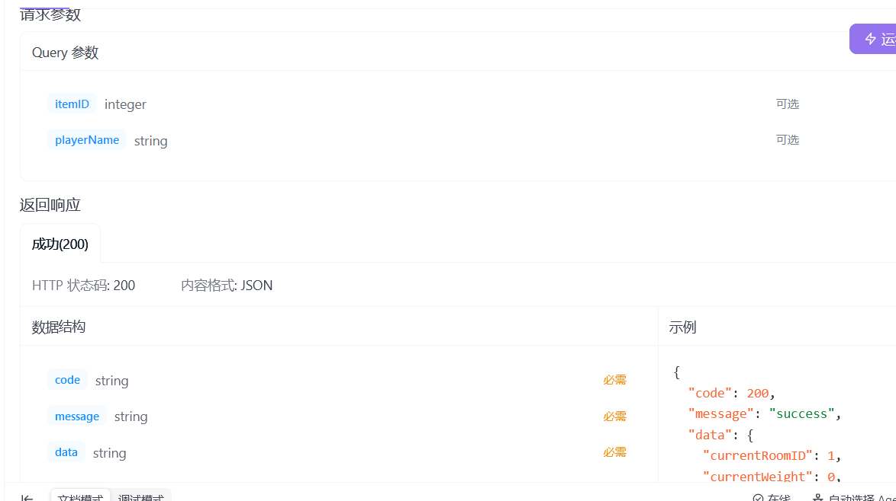

* item/feed

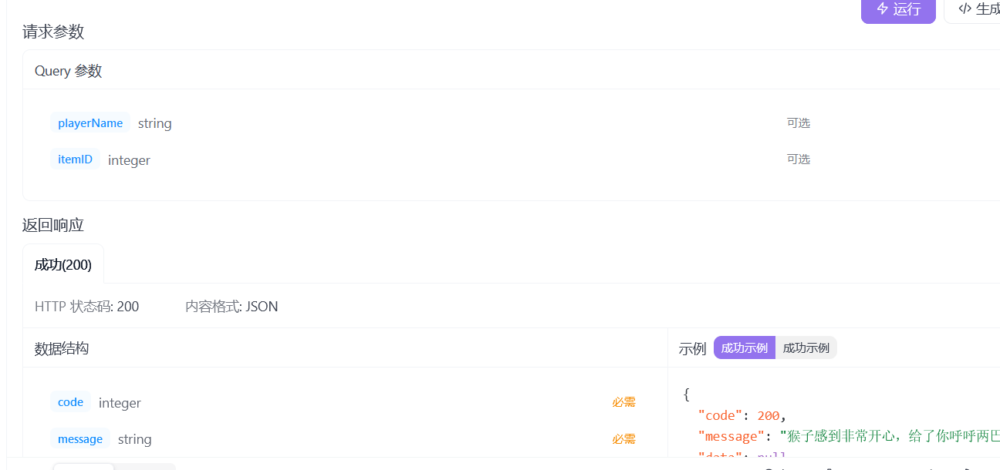

* room/back
  
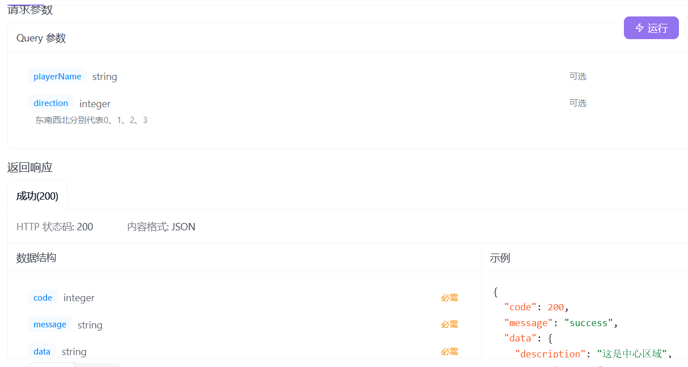


